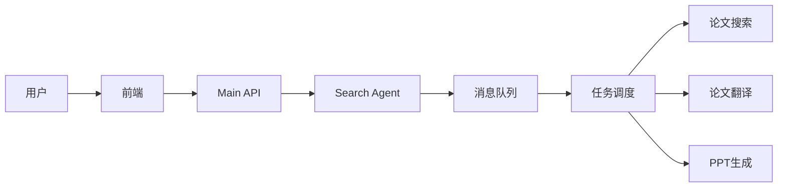

# 导航入口 Agent

一个基于 Google ADK 的论文助手系统，支持论文搜索、翻译和 PPT 生成。

## 功能特性

- 📄 **论文搜索** - 支持内部数据库和 Arxiv 双源搜索
- 🌐 **论文翻译** - 长任务异步翻译
- 📊 **PPT 生成** - 一键生成论文演示文稿
- 💬 **自然语言交互** - 通过自然语言发起任务

## 技术栈

| 组件 | 技术 |
|------|------|
| 前端 | Next.js + TailwindCSS |
| 后端 API | FastAPI |
| Agent 框架 | Google ADK |
| 消息队列 | RabbitMQ |
| 任务调度 | subagent_main |

## 系统架构



## 快速开始

### 前置准备

1. 安装 RabbitMQ
2. 运行 `python utils/create_mq_vhost.py` 创建虚拟主机
3. 复制环境变量：`cp env_template.txt .env` 并配置

### 启动所有服务

```bash
python start.py
```

### 单独启动

```bash
# Search Agent (端口 10060)
cd backend/search_agent && python main_api.py

# Main API (端口 10069)
cd backend/main_api && python main.py

# PPT Agent (端口 10071)
cd backend/pptagent && python main_api.py

# 前端 (端口 3030)
cd frontend && pnpm dev
```

## 访问地址

| 服务 | 地址 |
|------|------|
| 前端 | http://localhost:3030 |
| Main API | http://localhost:10069 |
| Search Agent | http://localhost:10080 |
| PPT Agent | http://localhost:10071 |
| subagent_main | http://localhost:10072 |

## Agent 工具说明

| 工具 | 输入 | 输出 |
|------|------|------|
| 内部论文搜索 | 搜索关键词 | 论文列表卡片 |
| Arxiv 搜索 | 搜索关键词 | 论文列表卡片 |
| 论文翻译 | paper_id | 任务状态卡片 |
| PPT 生成 | paper_id | 任务状态卡片 |

## 输出协议

所有输出使用 JSONCARD 格式包裹：

```json
```JSONCARD
[
  {
    "type": "paper_result | task | ppt_result",
    "version": "1.0",
    ...
  }
]
```

## 项目结构

```
.
├── backend/
│   ├── main_api/        # FastAPI 入口服务
│   ├── search_agent/    # 搜索 Agent
│   ├── pptagent/        # PPT 生成 Agent
│   └── subagent_main/   # 任务调度
├── frontend/            # Next.js 前端
├── train_agent/         # Agent 训练
└── utils/               # 工具脚本
```

## 截图预览


## 相关文档

- [PPT 生成流程](PPTGenerateProcess.md)
- [Agent 训练说明](train_agent/README.md)
