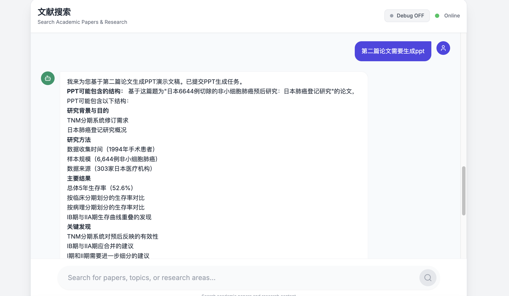
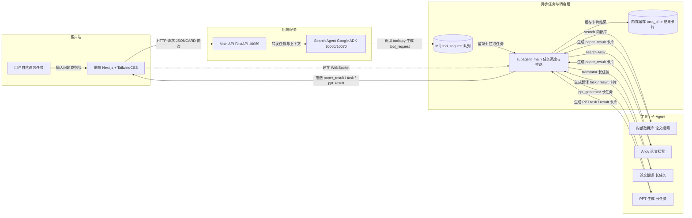

# 导航入口的Agent
# 部署和运行指南

## 整体流程
用户发起任务-->main_api-->search_agent-->tool写请求到MQ。
subagent_main监控MQ，根据任务调用不同的Agent执行，结果进行缓存到字典，等待前端获取。
前端收到main_api返回的Card，自动连接subagent_main的websocket，获取每个card的结果（前端和api使用websocket连接）。

## 启动方法
## 
1) 安装MQ，然后运行utils/create_mq_vhost.py
2) 修改.env文件，可以从env_template拷贝一份
3) python start.py ---快速一键所有服务

## 截图



## 访问应用

- 前端：http://localhost:3030
- Main API：http://localhost:10069
- Search Agent：http://localhost:10080
- ppt Agent: http://localhost:10071
- subagent_main: http://localhost:10072

## 原理



## Agent训练


## 架构说明

系统包含4个主要组件：

1. **Search Agent** (`backend/search_agent/`) - 基于 Google ADK 的导航Agent
2. **Main API** (`backend/main_api/`) - FastAPI 服务，作为前端和 Agent 的桥梁
4. **Frontend** (`frontend/`) - Next.js 前端应用

## 运行步骤

### 0. 启动本地的MQ，用于缓存search Agent发布的任务信息

### 1. 启动 Search Agent

```bash
cd backend/search_agent

# 安装依赖
pip install -r requirements.txt

# 配置环境变量（参考 .env 或 env_template）
# 需要配置：
# - LLM_MODEL (例如: gemini-1.5-flash)
# - MODEL_PROVIDER (例如: google_genai)
# - STREAMING=true
# - GOOGLE_API_KEY (如果使用 Google 模型)

# 启动服务（默认端口 10060）
python main_api.py
```

### 2. 启动 Main API

```bash
cd backend/main_api

# 安装依赖
pip install -r requirements.txt


# 启动服务（默认端口 10069）
python main.py
```

### 3. 启动前端

```bash
cd frontend

# 安装依赖
pnpm install

# 启动开发服务器
pnpm dev
```

## 访问应用

- 前端：http://localhost:3030
- Main API：http://localhost:10069
- search Agent：http://localhost:10080
- ppt Agent: http://localhost:10071
- subagent_main: http://localhost:10072

## search agent中的tools.py文件说明
一共2种任务， 搜索任务出搜索结果列表卡，执行任务出任务详情卡，返回格式都是json格式
Agent调用工具后，把请求写到MQ中，按一定格式写入
```
{
  "type": "tool_request",
  "version": "1.0",
  "task_id": "task_xxx",
  "trace_id": "trace_xxx",
  "timestamp": "2025-12-09T10:30:00+08:00",
  "tool": {
    "name": "translator | ppt_generator",
    "args": {}
  }
}

翻译：
    args = {
        "paper_id": paper_id,
        "target_lang": target_lang
    }
PPT：
    args = {
        "paper_id": paper_id,
    }

```

# Agent 智能体需求

## 1. 背景与目标

构建一个论文助手 Agent，前端使用 Next.js + TailwindCSS。Agent 支持论文搜索、翻译、生成PPT 三类能力，并通过结构化 JSON 卡片协议输出，便于前端统一解析与渲染。

## 2. 工具能力

系统提供 3 个工具（Tool）：

1. **内部数据库论文搜索工具**

   * 输入：用户的搜索问题/关键词
   * 输出：论文列表（包含标题、作者、摘要、链接等）

2. **搜索Arxiv的工具**
   * 输入：用户的搜索问题/关键词
   * 输出：论文列表（包含标题、作者、摘要、链接等）

3. **论文翻译工具（长任务，只能对内部数据库进行处理）**

   * 输入：论文 id
   * 输出：任务已提交信息（任务 id、状态、查询入口等）
   * 任务完成后返回翻译结果引用

4. **论文生成 PPT 工具（长任务，只能对内部数据库进行处理）**

   * 输入：论文 id
   * 输出：任务已提交信息（任务 id、状态、查询入口等）
   * 任务完成后返回 PPT 文件/下载链接

## 3. 交互流程

### 3.1 搜索论文

* 用户提问 → Agent 调用搜索工具 → 返回论文结果卡片
* 结果必须为结构化 JSONCARD，便于前端渲染论文卡

### 3.2 翻译论文（长任务）

* 用户发起翻译 → Agent 调用翻译工具 → 返回 task 卡片（accepted/running）
* 前端展示任务状态/进度
* 任务完成后，Agent 返回翻译结果卡片

### 3.3 生成 PPT（长任务）

* 用户发起生成 PPT → Agent 调用 PPT 工具 → 返回 task 卡片
* 任务完成后，Agent 返回 PPT 结果卡片（含下载/预览链接）

## 4. JSONCARD 输出协议（v1）

所有可解析输出必须包裹在 ` ```JSONCARD ... ``` ` 中，内容为数组。

### 4.1 论文搜索结果卡

```JSONCARD
[
  {
    "type": "paper_result",
    "version": "1.0",
    "id": "paper_batch_xxx",
    "payload": {
      "query": "...",
      "papers": [
        {
          "paper_id": "...",
          "title": "...",
          "authors": "...",
          "PublishTime": "",
          "abstract": "...",
          "pdf_url": "..."
        }
      ]
    }
  }
]
```

### 4.2 长任务状态卡（例如翻译/PPT 共用）

```JSONCARD
[
  {
    "type": "task",
    "version": "1.0",
    "id": "task_xxx",
    "payload": {
      "tool": "translator | ppt_generator",
      "status": "accepted | running | done | failed",
      "progress": 0.0,
      "message": "...",
    }
  }
]
```

## 5. 前端渲染要求

* 前端需解析 JSONCARD block：

  * 根据 `type` 分发到对应卡片组件
* 支持卡片流展示：

  * paper_result → 论文列表 UI
  * task → 任务进度/状态 UI
  * ppt_result → PPT 展示/下载 UI
  * error → 错误提示 UI
* JSONCARD 解析失败时，降级为普通文本展示。
