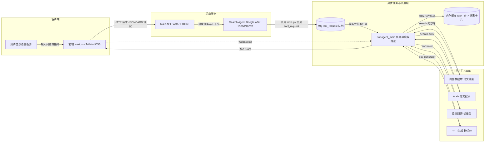
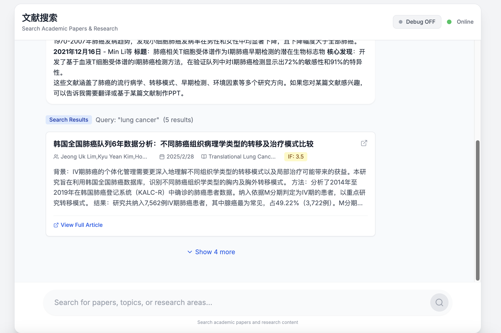
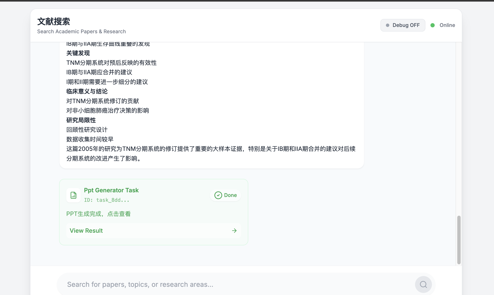
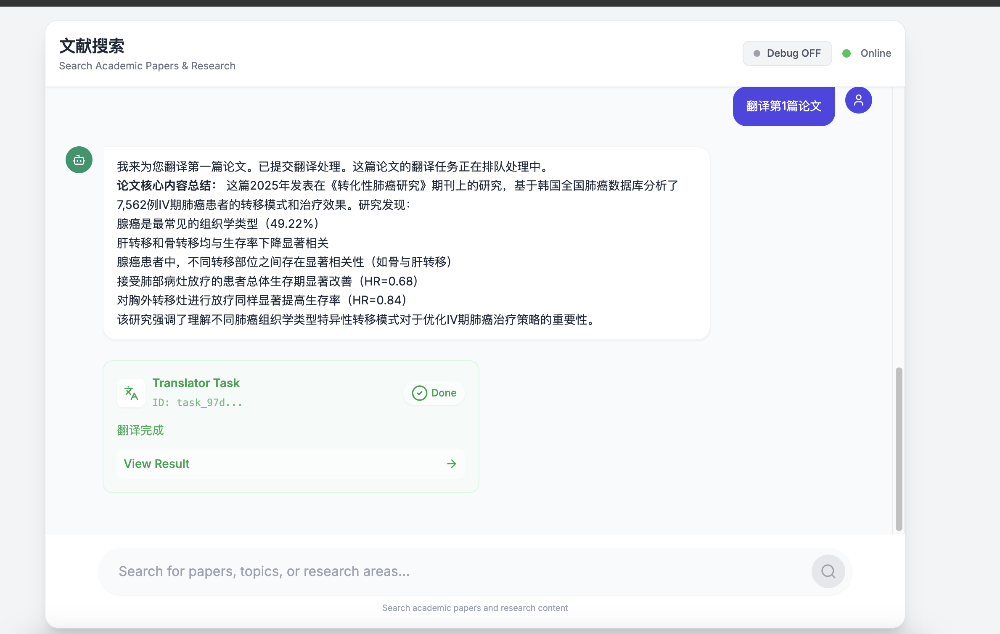
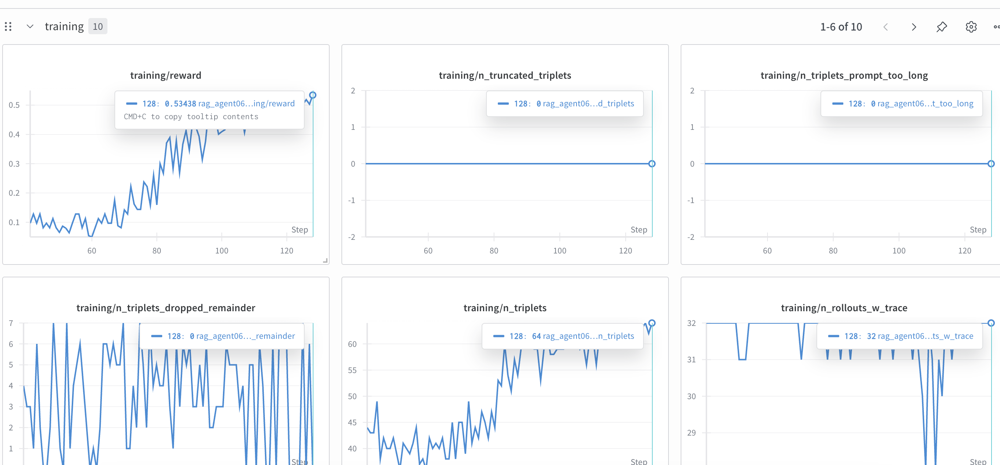

# 导航入口 Agent

## 部署与运行指南

---

## 一、项目概述

本项目是一个 **论文助手导航 Agent 系统**，支持：

* 📄 论文搜索（内部库 + Arxiv）
* 🌐 论文翻译（长任务）
* 📊 PPT 自动生成（长任务）

系统采用 **Agent + MQ + WebSocket + JSONCARD 协议** 架构，前端基于 **Next.js + TailwindCSS**，后端以 **FastAPI + Google ADK** 为核心。

1. 可以作为1个总的智能体调用其它智能体，类似A2A，但是A2A需要等待子Agent的数据返回，所以我考虑仅仅使用主Agent触发子Agent，子Agent的结果使用卡片返回个前端。
2. 可以采用LightningAgent进行强化学习训练，详细参考train_agent目录。


---

## 二、整体流程说明

### 2.1 高层流程

```
用户发起任务
   ↓
Main API
   ↓
Search Agent
   ↓
Tool 请求写入 MQ
   ↓
subagent_main 消费 MQ
   ↓
不同子 Agent 执行任务
   ↓
结果缓存并通过 WebSocket 推送给前端
```

### 2.2 详细说明

* 用户在前端发起自然语言任务
* `main_api` 负责接收请求并转发给 `search_agent`
* `search_agent` 调用 tools，将 **tool_request** 写入 MQ
* `subagent_main` 监听 MQ，根据任务类型调用不同 Agent
* 执行结果缓存到内存字典
* 前端通过 WebSocket 主动订阅任务结果（Card 流式返回）

---

## 三、启动方式（推荐）

### 3.1 快速一键启动

```bash
1) 安装 MQ
2) 运行 utils/create_mq_vhost.py
3) 复制 env_template 为 .env 并修改配置
4) python start.py   # 一键启动所有服务
```

---

## 四、访问地址汇总

| 服务            | 地址                                               |
| ------------- | ------------------------------------------------ |
| 前端            | [http://localhost:3030](http://localhost:3030)   |
| Main API      | [http://localhost:10069](http://localhost:10069) |
| Search Agent  | [http://localhost:10080](http://localhost:10080) |
| PPT Agent     | [http://localhost:10071](http://localhost:10071) |
| subagent_main | [http://localhost:10072](http://localhost:10072) |

---

## 五、系统原理与架构

### 5.1 架构原理图（Mermaid）




---

## 六、系统组件说明

系统包含以下主要组件：

1. **Search Agent**
   路径：`backend/search_agent/`
   基于 Google ADK 的导航 Agent，负责任务理解与工具调用。

2. **Main API**
   路径：`backend/main_api/`
   FastAPI 服务，前端与 Agent 的统一入口。

3. **subagent_main**
   MQ 消费者，负责调度长任务并通过 WebSocket 推送结果。

4. **Frontend**
   路径：`frontend/`
   Next.js + TailwindCSS，实现卡片流式展示。

---

## 七、分步运行指南（手动）

### 7.1 启动 MQ
```
docker run -d --hostname rabbitapp --name rabbitapp -e RABBITMQ_DEFAULT_USER=admin -e RABBITMQ_DEFAULT_PASS=welcome -p 4369:4369 -p 5671:5671 -p 5672:5672 -p 25672:25672 -p 15671:15671 -p 15672:15672 -p 15691:15691 -p 15692:15692 rabbitmq:3-management
```
用于缓存 Search Agent 发布的任务信息。

---

### 7.2 启动 Search Agent

```bash
cd backend/search_agent
pip install -r requirements.txt

# 配置 .env（或 env_template）

python main_api.py   # 默认端口 10060
```

---

### 7.3 启动 Main API

```bash
cd backend/main_api
pip install -r requirements.txt
python main.py       # 默认端口 10069
```

---

### 7.4 启动前端

```bash
cd frontend
pnpm install
pnpm dev
```

---

## 八、Search Agent 的 tools.py 说明

### 8.1 任务类型

一共两类任务：

1. **搜索任务**

   * 返回论文列表卡（paper_result）

2. **执行任务（长任务）**

   * 返回任务详情卡（task）

所有返回均为 **JSONCARD 格式**。

---

### 8.2 写入 MQ 的 tool_request 格式

```json
{
  "type": "tool_request",
  "version": "1.0",
  "task_id": "task_xxx",
  "trace_id": "trace_xxx",
  "timestamp": "2025-12-09T10:30:00+08:00",
  "tool": {
    "name": "translator | ppt_generator",
    "args": {}
  }
}
```

#### 翻译任务 args

```json
{
  "paper_id": "...",
  "target_lang": "..."
}
```

#### PPT 任务 args

```json
{
  "paper_id": "..."
}
```

---

## 九、Agent 智能体需求说明

### 9.1 背景与目标

构建一个论文助手 Agent，统一通过 **结构化 JSONCARD 协议** 与前端通信，支持：

* 搜索
* 翻译（长任务）
* PPT 生成（长任务）

---

### 9.2 工具能力定义

系统提供 3 类能力：

1. **内部数据库论文搜索**
2. **论文翻译（测试，长任务）**
3. **论文生成 PPT（测试，长任务）**

---

## 十、交互流程

### 10.1 搜索论文

* 用户提问
* Agent 调用搜索工具
* 返回 `paper_result` JSONCARD

### 10.2 翻译论文（长任务）

* 返回 `task` 卡片（accepted / running）
* 完成后返回翻译结果卡

### 10.3 生成 PPT（长任务）

* 返回 `task` 卡片
* 完成后返回 PPT 结果卡（下载/预览）

---

## 十一、JSONCARD 协议（v1）

### 11.1 论文搜索结果卡

```JSONCARD
[
  {
    "type": "paper_result",
    "version": "1.0",
    "id": "paper_batch_xxx",
    "payload": {
      "query": "...",
      "papers": [
        {
          "paper_id": "...",
          "title": "...",
          "authors": "...",
          "PublishTime": "",
          "abstract": "...",
          "pdf_url": "..."
        }
      ]
    }
  }
]
```

---

### 11.2 长任务状态卡

```JSONCARD
[
  {
    "type": "task",
    "version": "1.0",
    "id": "task_xxx",
    "payload": {
      "tool": "translator | ppt_generator",
      "status": "accepted | running | done | failed",
      "progress": 0.0,
      "message": "..."
    }
  }
]
```

---

## 十二、前端渲染要求

* 解析 JSONCARD block
* 根据 `type` 分发组件：

  * paper_result → 论文列表
  * task → 任务进度
  * ppt_result → PPT 下载/预览
  * error → 错误提示
* JSONCARD 解析失败时，降级为普通文本展示

---

## 十三、截图与训练记录

### 13.1 界面截图







### 13.2 Agent 训练


